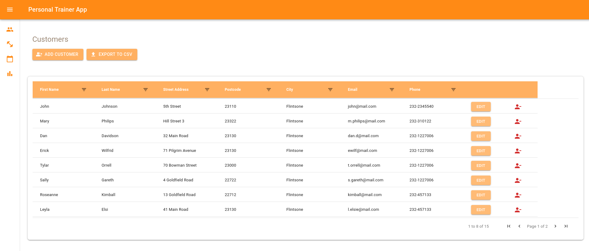
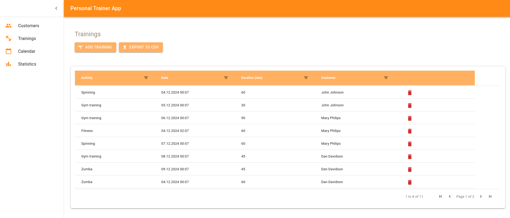
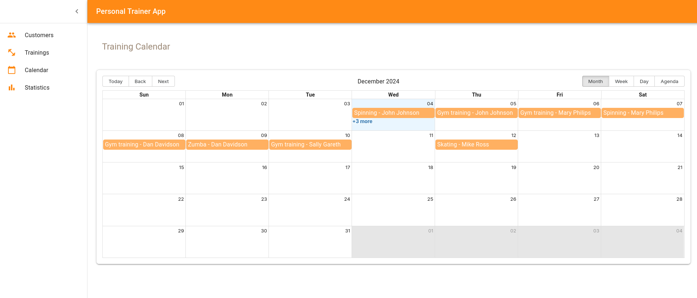
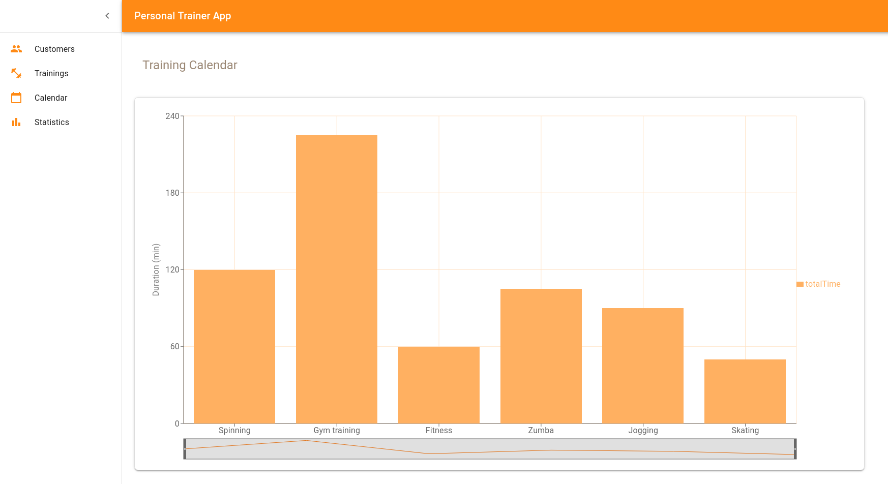
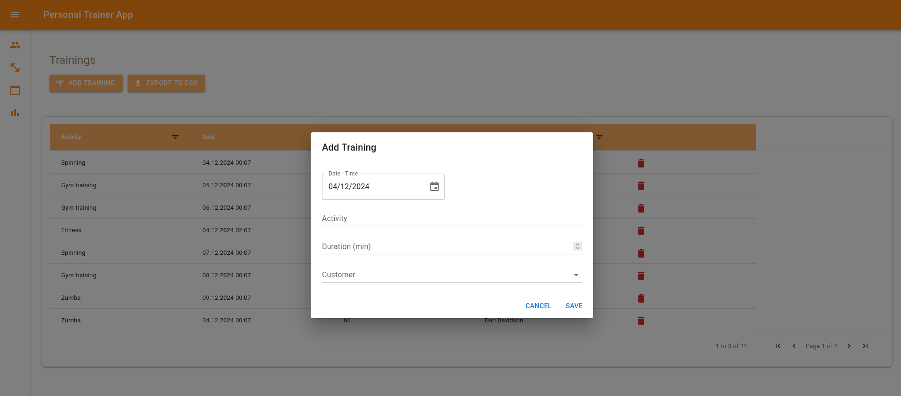
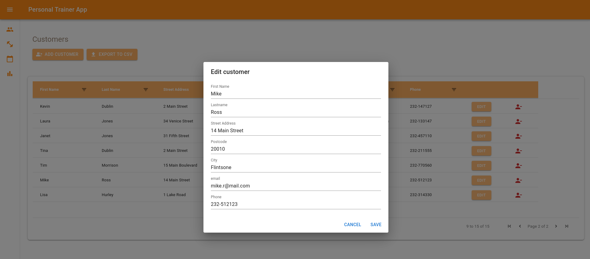

# Personal Trainer React Application

## Introduction
This web-based application is designed to manage customer training schedules, monitor activities, and enhance fitness tracking. This application allows personal trainers to efficiently manage training plans, track customer activities, and maintain a user-friendly interface for all interactions.

## Features
- **Customer Management**: Add, edit, and delete customer details, including personal information and contact details.
- **Training Management**: Schedule, view, update, and delete training sessions for customers.
- **Calendar View**: Visualize training sessions using an integrated calendar interface.
- **CSV Upload and Export**: Import and export customer or training data for offline analysis.
- **Statistics and Analytics**: View visualized data on customer activity, training duration, and performance metrics using interactive charts.
- **Responsive Design**:Mobile-friendly interface.

## Customers Page


## Trainings Page


## Calendar Page


## Statistics Page


## Add Training Page


## Edit Customer Page


## Technologies Used
- **React**
- **Material-UI (MUI)**
- **Day.js**
- **Recharts**
- **AG Grid**
- **Big Calendar**

# Installation 

## Prerequisites
-Clone the repository

```sh
git clone <repository-url>
```
-go to right directory

```sh
cd Personal-Trainer-React-App
```
-install the dependecies
```sh
npm i
```

## Environment Configuration
To configure the application, you need to create a `.env` file in the root directory of the repository.

### Example `.env` File
```dotenv
VITE_API_URL=https://customer-rest-service-frontend-personaltrainer.2.rahtiapp.fi/api/
```

### Run the Application
You can run the application using the following command:
```bash
npm run dev
```
